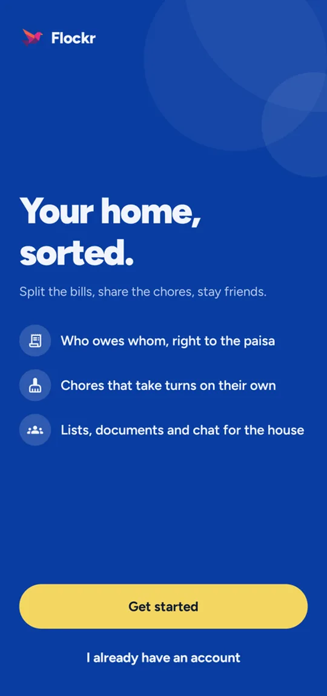
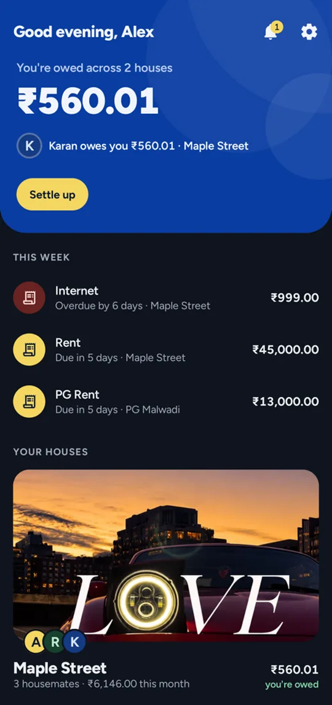
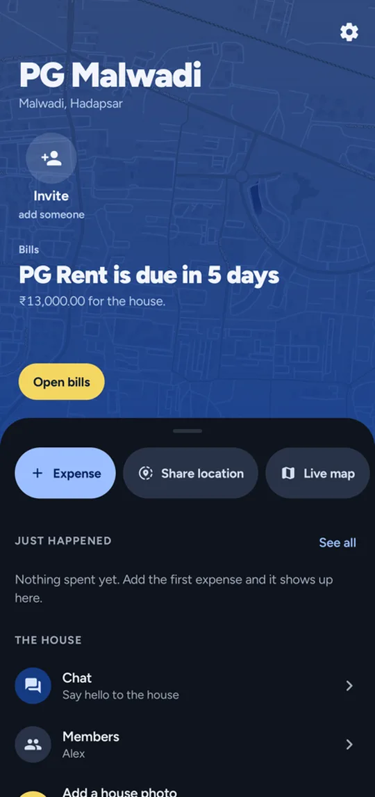
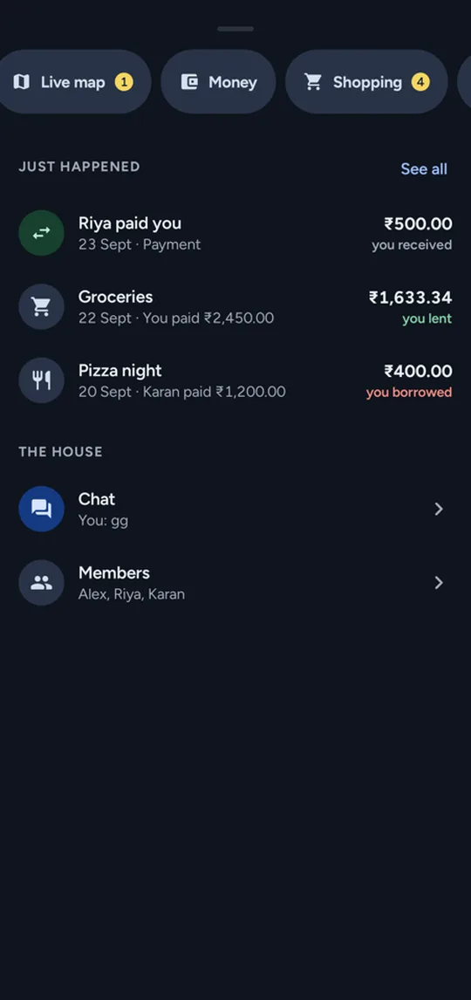
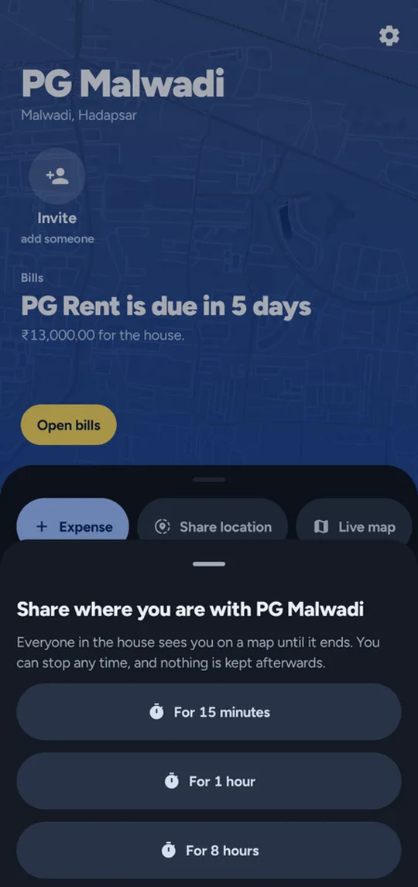
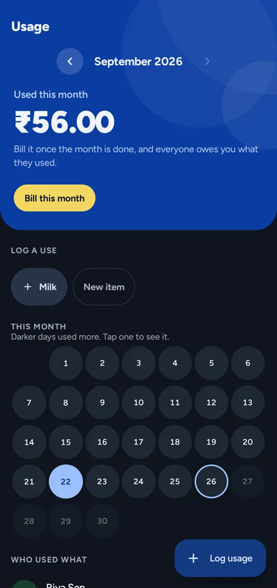
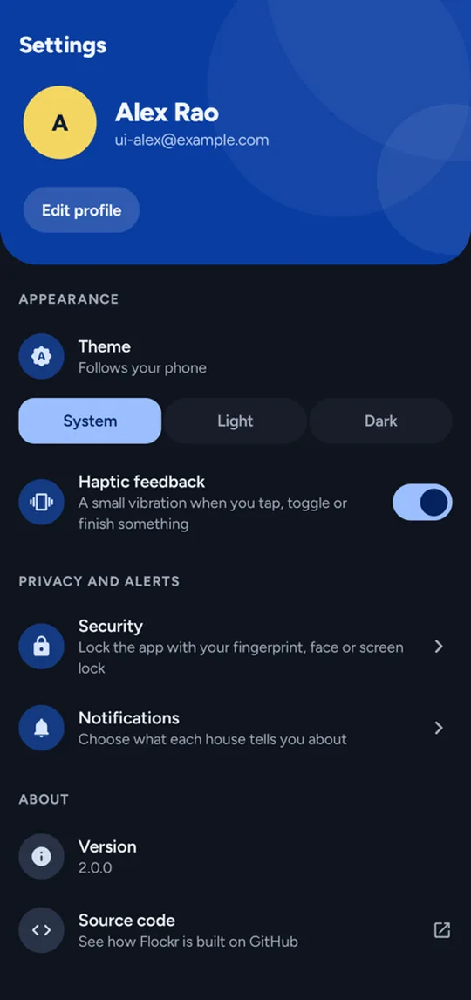
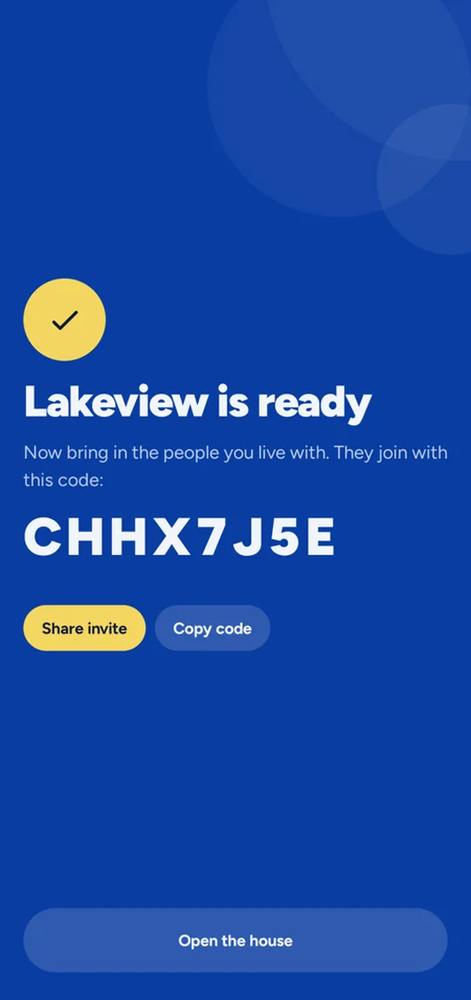

# Flockr

Flockr is an Android app for people who share a home. It keeps the house's money exact to the paisa
(expenses, bills, usage, balances and who should pay whom), alongside the shared shopping list,
chores, chat and documents. Flatmates, families and PGs all use it the same way: open the house, see
what needs you, act, and get on with the day.

Version 2.0.0 · Android 14 and newer · Kotlin, Jetpack Compose, Material 3 Expressive · Supabase

<p>
  
  
  
  
</p>
<p>
  
  
  
  
</p>

## What it does

**Money that adds up**
- Expenses split equally, by exact amounts, by percentage or by shares, with a live line of what
  each person will owe before you save.
- Recurring bills with reminders, early payment, and a history per bill.
- Usage items such as milk or water cans, logged in one tap, shown as a month calendar, and billed
  into the ledger at the end of the month.
- Balances and the fewest payments that settle everyone, with a shared history between any two
  housemates.
- Monthly reports by category, by person and by item.

Every amount is stored and computed in the house currency's smallest unit, in the database. Triggers
refuse anything that would leave the ledger out of balance, so the phone never does sums the server
disagrees with.

**The house itself**
- A hub per house: your standing with each housemate, a swipeable stack of what needs you now, and a
  drawer that pulls up into the rest of the house.
- Shared shopping list grouped by aisle, chores with rotation and effort points, house chat, and a
  document vault for leases and receipts.
- Several houses per person, each with its own currency, date layout, week start and time zone.
- The house's photo, or a map of its street when there's no photo, behind its page.

**Where everyone is**
- Share your location with one house for 15 minutes, an hour or 8 hours. Housemates see you on a
  live map with how far you are from home, and can open directions to you.
- The server sets when each share ends and deletes it afterwards, so nothing is kept. A share needs
  only foreground location permission, and a notification stays up with a Stop button while it runs.

**Getting started**
- A first run that asks your name, then walks you through creating a house or joining one with a
  code, and ends on the code to send your housemates.

**Notifications**
- Push notifications through Firebase Cloud Messaging, sent by a Supabase Edge Function the moment
  the database records something, with per-house, per-type preferences.

## Design

The app follows a written design system: [DESIGN.md](DESIGN.md) for the visual rules and components,
[PRODUCT.md](PRODUCT.md) for who it's for and what it should feel like. In short: a cobalt palette in
OKLCH that meets WCAG AA in light and dark, Figtree throughout with tabular figures, content straight
on the page with no cards, forms written as sentences you tap into, Material 3 Expressive components
and motion, skeleton loading, and haptics that match what each gesture means.

## Getting started

You need Android Studio (latest stable), JDK 17, a Supabase project, and a Firebase project for push.

### 1. The database

The whole backend lives in `supabase/`. Apply the schema in order, in one transaction:

```bash
cat supabase/schema/0*.sql | psql "$DATABASE_URL" --single-transaction
```

This creates the tables, row-level security, RPCs, storage buckets, realtime publication, the
hourly bill-reminder job and the five-minute sweep of ended location shares (`pg_cron`), and the
push trigger (`pg_net`). `00_reset.sql` drops the
`public` schema first, so only run it against a project whose data you can lose.

### 2. Push notifications

1. Deploy the Edge Function: `supabase functions deploy push --no-verify-jwt`.
2. In Supabase, add two Edge Function secrets: `PUSH_WEBHOOK_SECRET` (any long random string) and
   `FCM_SERVICE_ACCOUNT` (the JSON of a Firebase service account key, from Firebase → Project
   settings → Service accounts).
3. In the database's Vault, add `push_function_url` (the function's URL) and `push_webhook_secret`
   (the same string as above). The trigger reads both and does nothing until they exist.
4. Put your Firebase project's `google-services.json` in `app/`.

### 3. Local configuration

Create `local.properties` in the project root:

```properties
SUPABASE_URL=https://your-project.supabase.co
SUPABASE_KEY=your-publishable-key
GOOGLE_CLIENT_ID=your-web-oauth-client-id.apps.googleusercontent.com
```

For Google sign-in, the web client ID goes here and in Supabase Auth's Google provider, and an
Android OAuth client with package `in.xroden.flockr` and your signing key's SHA-1 must exist in the
same Google Cloud project.

Maps need no configuration: they use MapLibre with OpenFreeMap's free tiles, with no key or account.

### 4. Build

```bash
./gradlew assembleDebug
```

## Project layout

```
app/src/main/java/in/xroden/flockr/
├── features/        one folder per part of the app, each with data, model, presentation and ui
│   ├── auth  chat  chores  documents  expenses  house  location  notifications  settings  shopping
├── ui/
│   ├── components/  the shared components DESIGN.md describes
│   ├── navigation/  type-safe routes, graphs and screen transitions
│   └── theme/       colour, type, shape, spacing and motion tokens
├── core/            realtime queries, serializers, validation, app lock, storage, error messages
├── di/              Hilt modules
└── utils/           money, dates, haptics, image shrinking
supabase/
├── schema/          the database, numbered in the order it is applied
└── functions/push/  the Edge Function that sends push notifications
```

Each feature keeps its request bodies next to its repository in `data/` and its types in `model/`.
The screens hold no business logic. ViewModels expose state as `StateFlow`, repositories talk to
Supabase and stay current through one `liveQuery` helper on Supabase Realtime, and anything that must be exact or consistent (balances, splits, the settle-up plan,
monthly summaries) is a database function.

## Testing

```bash
./gradlew testDebugUnitTest
```

Unit tests cover money parsing and formatting, split apportioning, share weights, validators, house
configuration and haptics. CI runs the build, unit tests and lint on every pull request into `main`.

## Releases

Versions follow Conventional Commits through release-please. `version.properties` holds the version
name, and the version code is derived from it. Publishing a GitHub release builds and attaches the
signed APK (arm64 and armv7) and bundle. See [CHANGELOG.md](CHANGELOG.md).

## License

MIT. See [LICENSE](LICENSE).
